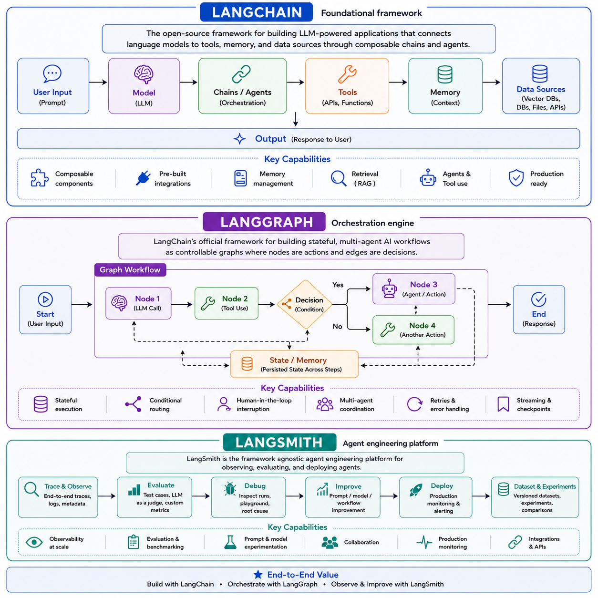
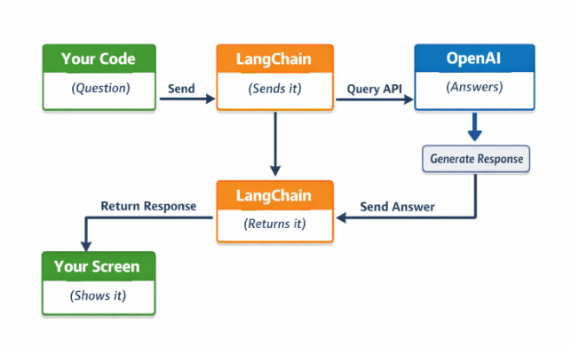
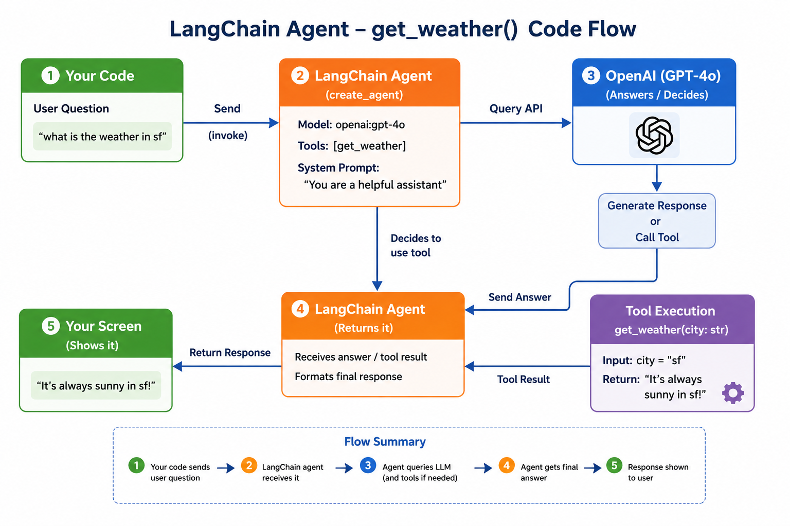
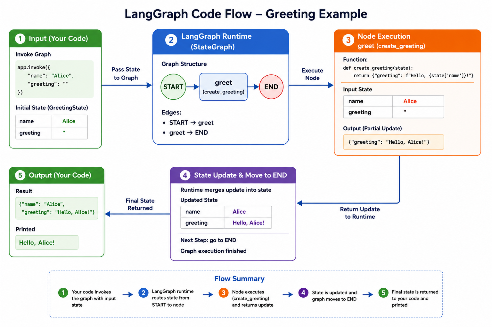

# LangChain/LangGraph - The Complete Guide

## Introduction

An AI framework is a pre-built software library or platform that provides tools, APIs, and abstractions to help developers build, train, and deploy AI/ML models — without having to write everything from scratch.

[LangChain](https://www.langchain.com/langchain) -  `Foundational framework` - The open-source framework for building LLM-powered applications that connects language models to tools, memory, and data sources through composable chains and agents.

[LangGraph](https://www.langchain.com/langgraph) - `Orchestration engine` - LangChain's official framework for building stateful, multi-agent AI workflows as controllable graphs where nodes are actions and edges are decisions.

[LangSmith](https://www.langchain.com/langsmith-platform) - `Agent engineering platform` - LangSmith is the framework agnostic agent engineering platform for observing, evaluating, and deploying agents.

[Deepagents](https://docs.langchain.com/oss/python/deepagents/overview) - `Agent Harness` - Deepagents is a standalone library built on top of LangChain’s core building blocks for agents. It uses the LangGraph runtime for durable execution, streaming, human-in-the-loop, and other features.

## Architecture



## Installation

```ai
To install the `LangChain` package:

pip install -U langchain

LangChain provides integrations to hundreds of LLMs.

#### Installing the OpenAI integration
pip install -U langchain-openai

#### Installing the Anthropic integration
pip install -U langchain-anthropic

#### Optional but useful
pip install python-dotenv

To install the `LangGraph` package:

pip install -U langgraph

To install the `Deepagents` package:

pip install -qU deepagents langchain-google-genai

```

## LangChain/LangGraph Conceptual / Practical Guide

Build with LangChain → Orchestrate with LangGraph → Monitor with LangSmith → Ship faster with Deepagents

| Component | Simple Meaning | Main Purpose |
|---|---|---|
| `LangChain` | Foundation framework for AI apps | Connect LLMs with tools, memory, APIs, and data |
| `LangGraph` | Workflow engine for AI agents | Build stateful and multi-agent workflows using graphs |
| `LangSmith` | Monitoring and debugging platform | Observe, test, evaluate, and deploy AI agents |
| `Deepagents` | Agent execution library on LangGraph | Run durable AI agents with streaming and human approval |

## LangChain Agents

Let's build a simple AI that answers questions.

Create a file: `langchain_chat.py`

```ai
from dotenv import load_dotenv
from langchain_openai import ChatOpenAI

# Load OPENAI API KEY from .env
load_dotenv()

# Initialize/Create the AI model
llm = ChatOpenAI(model="gpt-4o")

# Call LLM with a user prompt
response = llm.invoke("What is Agent Skills?")

# Print LLM Response
print(response.content)
```

#### Flow


#### Run
```ai
$ python langchain_chat.py 
"Agent Skills" can refer to a variety of things depending on the context. Generally, it involves the specific abilities or expertise required to perform tasks efficiently and effectively in roles typically associated with "agents." Here are a few contexts where "Agent Skills" might apply:

1. **Call Center or Customer Service Agents**: 
   - Skills could include effective communication, problem-solving, empathy, active listening, and technical proficiency with customer service software.

2. **Real Estate Agents**: 
   - Skills might encompass negotiation, market analysis, interpersonal communication, sales strategies, and local area knowledge.

3. **Secret or Intelligence Agents**:
   - Skills could involve discretion, surveillance, analytical thinking, physical fitness, proficiency in foreign languages, and expertise in technology or cyber operations.

4. **Artificial Intelligence (AI) Agents**:
   - In this context, skills might refer to the capabilities programmed into AI agents, such as natural language processing, machine learning, data analysis, and decision-making processes.

If none of these contexts match what you're referring to, could you please provide more details?
```

To use OpenAI-compatible local or third-party endpoints (like Ollama, vLLM, or LiteLLM) base_url and api_key need to pass

Create a file: `langchain_chat_litellm.py`

```ai
import os
from dotenv import load_dotenv
from langchain_openai import ChatOpenAI

# Load .env
load_dotenv()

# Read litellm credentials
litellm_key = os.getenv("LITELLM_KEY")
litellm_url = os.getenv("LITELLM_URL")

# ChatOpenAI to use your litellm endpoint, not api.openai.com
llm = ChatOpenAI(
    model="gpt-4o",                  # confirm the model name available on litellm
    api_key=litellm_key,             # litellm key
    base_url=litellm_url             # litellm url
)

response = llm.invoke("What is Agent Skilks?")

print(response.content)
```

#### Run

```ai
$ python langchain_chat_litellm.py 
It seems like you may be referring to "Agent Skills," but you might be referencing something else. If you're talking about "Agent Skills," it’s a concept that could apply in various contexts:

1. **Artificial Intelligence Agents**: In AI, "agent skills" refer to the abilities or tasks that an intelligent agent (like a virtual assistant or autonomous bot) is designed to perform. For example, skills could include answering questions, controlling smart devices, or solving specific problems.

2. **Customer Service or Call Center Agents**: "Agent skills" might refer to the competencies and abilities of human agents working in customer support roles. Common skills in this context include communication, problem-solving, empathy, product knowledge, and technical expertise.

3. **Gaming or Fiction**: If you mean a specific game, story, or movie reference, "Agent Skilks" might be a character or concept, but I couldn’t find information on it. 

Could you clarify further if you're referring to a specific subject, context, or name? I'd be happy to help!
```

Let's build a simple AI Agent that predict weather of the city. Start by creating a simple agent that can answer questions and call tools. 

Create a file: `langchain_agent.py`

```ai
from dotenv import load_dotenv
from langchain.agents import create_agent

# Load OPENAI API KEY from .env
load_dotenv()

# Define Tool/Function
# A plain Python function becomes a "tool" the agent can call.
def get_weather(city: str) -> str:
    """Get weather for a given city."""
    return f"It's always sunny in {city}!"

# Create the AI agent
agent = create_agent(
    model="openai:gpt-5.5",
    tools=[get_weather],
    system_prompt="You are a helpful assistant"
)

# Call Agent with a user prompt. Agents are invoked with a "messages" list.
result = agent.invoke(
    {"messages": [{"role": "user", "content": "What's the weather in sf?"}]}
)

# Print Agent Response
print(result["messages"][-1].content_blocks)
```

#### Flow


#### Run

```ai
$ python langchain_agent.py
[{'type': 'text', 'text': 'It’s currently sunny in San Francisco.'}]
```

## Deep Agents

deepagents is a standalone library built on top of LangChain’s core building blocks for agents. It uses the LangGraph runtime for durable execution, streaming, human-in-the-loop, and other features. The deepagents repository contains:

Deep Agents SDK: A package for building agents that can handle any task
Deep Agents Code: A terminal coding agent built on the Deep Agents SDK
ACP integration: An Agent Client Protocol connector for using deep agents in code editors like Zed

Let's build a simple deep agents SDK based agent for ai assistant.

Create a file: `deepagents_agent.py`

```ai
from dotenv import load_dotenv
from deepagents import create_deep_agent

# Load OPENAI API KEY from .env
load_dotenv()

# Define Tool/Function
# A plain Python function becomes a "tool" the agent can call.
def get_weather(city: str) -> str:
    """Get weather for a given city."""
    return f"It's always sunny in {city}!"

# Create the AI agent
agent = create_deep_agent(
    model="openai:gpt-5.5",
    tools=[get_weather],
    system_prompt="You are a helpful assistant",
)

# Call Agent with a user prompt. Agents are invoked with a "messages" list.
result = agent.invoke(
    {"messages": [{"role": "user", "content": "what is the weather in sf"}]}
)

# Print Agent Response
print(result["messages"][-1].content_blocks)
```

#### Run

```ai
$ python deepagents_agent.py 
[{'type': 'text', 'text': 'It’s always sunny in San Francisco!', 'annotations': [], 'id': 'msg_031c9187a054fcb3006a8056f5f7288194bd0805519adfa38f', 'phase': 'final_answer'}]

```

## LangGraph Agents

Let's build a simple graph that takes a name and generates a greeting.

Create a file: `langgraph_agent.py`

1.4.1. Step 1: Import Required Modules
```ai
from typing import TypedDict
from langgraph.graph import StateGraph, START, END
```
1.4.2. Step 2: Define Your State
```ai
class GreetingState(TypedDict):
    name: str
    greeting: str
```
1.4.3. Step 3: Create Node Functions
```ai
def create_greeting(state: GreetingState) -> dict:
    """Create a greeting message."""
    name = state["name"]
    return {"greeting": f"Hello, {name}! Welcome to LangGraph!"}
```
1.4.4. Step 4: Build the Graph
```ai
# Create the graph with your state type
graph = StateGraph(GreetingState)

# Add your node
graph.add_node("greet", create_greeting)

# Connect: START -> greet -> END
graph.add_edge(START, "greet")
graph.add_edge("greet", END)

# Compile (required before running)
app = graph.compile()
```
1.4.5. Step 5: Run the Graph
```ai
result = app.invoke({"name": "Alice", "greeting": ""})
print(result["greeting"])
# Output: Hello, Alice! Welcome to LangGraph!
```
Complete Example
```ai
from typing import TypedDict
from langgraph.graph import StateGraph, START, END

# Define state
class GreetingState(TypedDict):
    name: str
    greeting: str

# Define node
def create_greeting(state: GreetingState) -> dict:
    return {"greeting": f"Hello, {state['name']}!"}

# Build graph
graph = StateGraph(GreetingState)
graph.add_node("greet", create_greeting)
graph.add_edge(START, "greet")
graph.add_edge("greet", END)
app = graph.compile()

# Run
result = app.invoke({"name": "Alice", "greeting": ""})
print(result["greeting"])  # Hello, Alice!
```

#### Flow



#### Run

```ai
$ python langgraph_agent.py 
Hello, Alice!
```

## 🤝 Let's Build Together

This is an open, evolving workspace for AI frameworks. If you're exploring similar concepts in AI Frameworks, LangChain, or agentic workflows, open an issue, fork it, or reach out — let's collaborate and build this together!


## 👤 Author

**Vishvendra Singh** — AI Engineer • Technology Leader • Innovation • Strategy • Governance • Observability • DevOps • SRE • Cloud • Open-Source Contributor

[LinkedIn](https://www.linkedin.com/in/vishvendrasingh1) · [GitHub](https://github.com/Vish-TechOps)